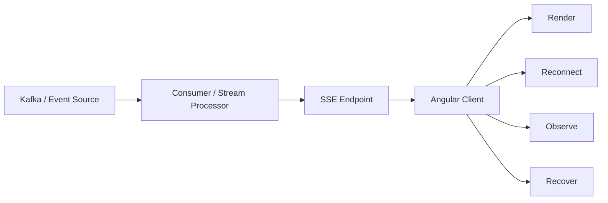

# Angular SSE — Real-Time Streaming Lab

> **Real-time delivery · failure-first engineering · browser streaming**

This repository is an implementation lab for understanding **Server-Sent Events (SSE)** as a production boundary—not just learning the API.


## The engineering question

> When is a streaming channel the right boundary, and what must the client and server do when the connection is unreliable?

## Architecture



## Failure-first exercises

- connection drops and reconnects
- duplicate events
- delayed events
- stale client state
- event ordering
- server restart
- malformed payloads
- heartbeat / liveness
- backpressure expectations
- observability around connection and event state

## Current implementation

The original application uses Angular CLI 10.0.2, Angular 10.x, TypeScript 3.9.x and RxJS 6.5.x. It is being modernized incrementally rather than presented as a current-stack application.

## Run locally

```bash
npm install
npm start
```

Then open `http://localhost:4200/`.

## Kafka extension

```text
Kafka topic
    ↓
consumer / stream processor
    ↓
SSE endpoint
    ↓
Angular client
```

The dedicated event-platform lab is **[KafkaEventPlatform](https://github.com/MountainBridge/KafkaEventPlatform)**.

## Interview questions

1. Why SSE instead of WebSockets or polling?
2. What happens when the browser disconnects for 30 seconds?
3. How do you prevent duplicate state transitions?
4. Where should ordering be enforced?
5. What happens if Kafka publishes an event but the SSE consumer crashes?
6. What is the source of truth when the browser and backend disagree?
7. How would you observe and debug a missing event?

## Evidence standard

Every new experiment records:

**scenario → implementation → test data → failure injected → observed behaviour → measurement → decision → trade-off**
